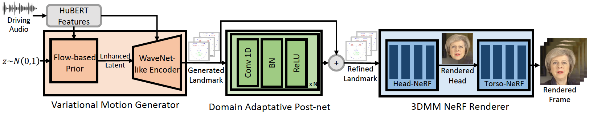

# GeneFace: Generalized and High-Fidelity Audio-Driven 3D Talking Face Synthesis | ICLR'23

#### Zhenhui Ye, Ziyue Jiang, Yi Ren, Jinglin Liu, Jinzheng He, Zhou Zhao | Zhejiang University, ByteDance

[](https://arxiv.org/abs/2301.13430)| [](https://github.com/yerfor/GeneFace) |  | [](https://github.com/yerfor/GeneFace/releases) | [中文文档](README-zh.md)


This repository is the official PyTorch implementation of our [ICLR-2023 paper](https://arxiv.org/abs/2301.13430)\, in which we propose **GeneFace** for generalized and high-fidelity audio-driven talking face generation. The inference pipeline is as follows:

<p align="center">
    <br>
    
    <br>
</p>

Our GeneFace achieves better lip synchronization and expressiveness to out-of-domain audios. Watch [this video](https://geneface.github.io/GeneFace/example_show_improvement.mp4) for a clear lip-sync comparison against previous NeRF-based methods. You can also visit our [project page](https://geneface.github.io/) for more details.

## 🔥Update:
- `2023.3.16` We release a big update in [this release](https://github.com/yerfor/GeneFace/releases/tag/v1.1.0), a video demo is [here](assets/zozo_radnerf_torso_smo.mp4). including: 1) RAD-NeRF-based renderer, which could infer in real-time and be trained in 10 hours. 2) pytorch-based deep3d_reconstruction module, which is easier to install and is 8x faster than the previous TF-based version. 3) pitch-aware audio2motion module which could generate more lip-sync landmark. 4) fix some bugs that cause large memory usage. 5) We will upload the paper about this update soon.
- `2023.2.22` We release a 1 minute-long [demo video](https://geneface.github.io/GeneFace/how_i_want_to_say_goodbye.mp4), in which GeneFace is driven by a Chinese song generated by [DiffSinger](https://github.com/MoonInTheRiver/DiffSinger).
- `2023.2.20` We release a stable 3D landmark post-processing strategy in `inference/nerfs/lm3d_nerf_infer.py`, which improve the stability and quality of the final results by a large margin.

## Quick Started!

We provide pre-trained models and processed datasets of GeneFace in [this release](https://github.com/yerfor/GeneFace/releases/tag/v1.1.0) to enable a quick start. In the following, we show how to infer the pre-trained models in 4 steps. If you want to train GeneFace on your own target person video, please reach to the following sections (`Prepare Environments`, `Prepare Datasets`, and `Train Models`).

- Step1. Create a new python env named `geneface` following the guide in `docs/prepare_env/install_guide.md`.

- Step2. Download the `lrs3.zip` and `May.zip` in [the release](https://github.com/yerfor/GeneFace/releases/tag/v1.1.0) and unzip it into the `checkpoints` directory.

- Step3. Process the dataset of `May.mp4` following the guide in `docs/process_data/process_target_person_video.md`. Then you can see a output file named `data/binary/videos/May/trainval_dataset.npy`.

After the above steps, the structure of your `checkpoints` and `data` directory should look like this:

```
> checkpoints
    > lrs3
        > lm3d_vae_sync
        > syncnet
    > May
        > lm3d_postnet_sync
        > lm3d_radnerf
        > lm3d_radnerf_torso
> data
    > binary
        > videos
            > May
                trainval_dataset.npy
```

- Step4. Run the scripts below:

```
bash scripts/infer_postnet.sh
bash scripts/infer_lm3d_radnerf.sh
# bash scripts/infer_radnerf_gui.sh # you can also use GUI provided by RADNeRF
```

You can find a output video named `infer_out/May/pred_video/zozo.mp4`.

## Prepare Environments

Please follow the steps in `docs/prepare_env`.

## Prepare Datasets
Please follow the steps in `docs/process_data`.

## Train Models

Please follow the steps in `docs/train_models`.

# Train GeneFace on other target person videos

Apart from the `May.mp4` provided in this repo, we also provide 8 target person videos that were used in our experiments. You can download them at [this link](https://drive.google.com/drive/folders/1FwQoBd1ZrBJMrJE3ZzlNhK8xAe1OYGjX?usp=share_link). To train on a new video named `<video_id>.mp4`, you should place it into the `data/raw/videos/` directory, then create a new folder at `egs/datasets/videos/<video_id>` and edit config files, according to the provided example folder `egs/datasets/videos/May`.

You can also record your own video and train a unique GeneFace model for yourself!


## Citation

```
@article{ye2023geneface,
  title={GeneFace: Generalized and High-Fidelity Audio-Driven 3D Talking Face Synthesis},
  author={Ye, Zhenhui and Jiang, Ziyue and Ren, Yi and Liu, Jinglin and He, Jinzheng and Zhao, Zhou},
  journal={arXiv preprint arXiv:2301.13430},
  year={2023}
}
```

## Acknowledgements

**Our codes are based on the following repos:**

* [NATSpeech](https://github.com/NATSpeech/NATSpeech) (For the code template)
* [AD-NeRF](https://github.com/YudongGuo/AD-NeRF) (For NeRF-related data preprocessing and vanilla NeRF implementation)
* [RAD-NeRF](https://github.com/ashawkey/RAD-NeRF) (For RAD-NeRF implementation)
* [Deep3DFaceRecon_pytorch](https://github.com/sicxu/Deep3DFaceRecon_pytorch) (For 3DMM parameters extraction)
