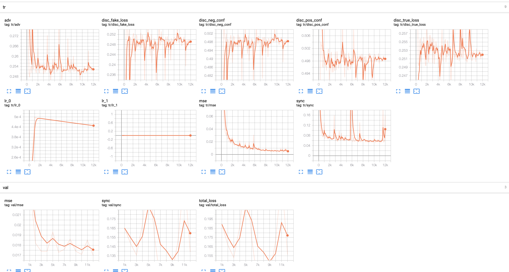

# 训练 GeneFace!

GeneFace 包含三个模块：1）一个训练于LRS3数据集并通用于所有说话人的 `语音转动作`模块；2）一个适用于特定说话人的 `动作后处理`网络，它被训练于LRS3数据集和对应说话人的视频数据；3）一个适用于特定说话人的 `基于NeRF的渲染器`，它被训练于对应说话人的视频数据。

要训练GeneFace，请首先按照我们在 `docs/prepare_env`文档和 `docs/process_data`文档中的步骤，分别完成搭建环境和准备数据集。

在[这个链接](https://github.com/yerfor/GeneFace/releases/tag/v1.1.0)中，我们还准备了GeneFace的预训练模型，其中：

* `lrs3.zip` 包含了在LRS3数据集上训练的模型 (包括一个 `lm3d_vae_sync`模型以实现语音转动作的变换，和一个 `syncnet`以实现对语音-嘴形对齐程度的衡量)，这些模型是通用于所有说话人视频的。
* `May.zip` 包含了我们在 `May.mp4`视频上训练的所有模型（包括一个 `postnet`以对 `lm3d_vae_sync`产生的3D landmark进行后处理，以及一个 `lm3d_radnerf`和 `lm3d_radnerf_torso`分别渲染说话人的头部和躯干部位。）对每个说话人视频，你都需要新训练这三个模型。

## 步骤1. 训练SyncNet模型

注意：我们在[这个链接](https://github.com/yerfor/GeneFace/releases/tag/v1.1.0)的 `lrs3.zip`文件中提供了预训练好的SyncNet,你可以将其下载并提取出其中的 `syncnet`文件夹，并将它放到 `checkpoints/lrs3/syncnet`路径中。

如果你想要从头训练SyncNet，请执行以下命令行（你需要首先准备好LRS3数据集）：

```
conda activate geneface
export PYTHONPATH=./
CUDA_VISIBLE_DEVICES=0 python tasks/run.py --config=egs/datasets/lrs3/lm3d_syncnet.yaml --exp_name=lrs3/syncnet
```

注意SyncNet模型适用于所有说话人视频，所以你只需要训练它一次！

## 步骤2. 训练Audio2Motion模型

注意：我们在[这个链接](https://github.com/yerfor/GeneFace/releases/tag/v1.1.0)的 `lrs3.zip`文件中提供了预训练好的audio2motion模型,你可以将其下载并提取出其中的 `lm3d_vae_sync`文件夹，并将它放到 `checkpoints/lrs3/lm3d_vae_sync`路径中。

如果你想要从头训练audio2motion模型，请执行以下命令行（你需要首先准备好LRS3数据集）：

```
conda activate geneface
export PYTHONPATH=./
CUDA_VISIBLE_DEVICES=0 python tasks/run.py --config=egs/datasets/videos/lrs3/lm3d_vae_sync.yaml --exp_name=lrs3/lm3d_vae_sync
```

注意名为 `lm3d_vae_sync`的audio2motion模型适用于所有说话人视频，所以你只需要训练它一次！

## 步骤3. 训练PostNet模型

注意：我们在[这个链接](https://github.com/yerfor/GeneFace/releases/tag/v1.1.0)的 `May.zip`文件中提供了专用于 `data/raw/videos/May.mp4`视频的预训练好的Postnet模型,你可以将其下载并提取出其中的 `postnet`文件夹，并将它放到 `checkpoints/May/postnet`路径中。

如果你想要从头训练postnet模型，请执行以下命令行（你需要首先准备好LRS3数据集和对应的说话人视频数据集）：

```
conda activate geneface
export PYTHONPATH=./
CUDA_VISIBLE_DEVICES=0 python tasks/run.py --config=egs/datasets/videos/May/lm3d_postnet_sync.yaml --exp_name=May/postnet
```

注意postnet模型仅适用于对应的说话人视频，所以对每个新的说话人视频你都需要训练一个新的postnet。

#### 训练小tips：选择合适步数的checkpoint

由于我们的postnet的训练属于对抗域适应（Adversarial Domain Adaptation）过程，而对抗训练的训练过程被广泛公认是不稳定的。例如当训练步数过多时，可能导致模型出现模式坍塌，比如postnet可能会学到将输入的任意表情都映射到同一个target person domain的表情（体现在validation sync/mse loss上升）。因此为了避免最终得到的人脸表情的lip-sync性能下降过大，我们应该early stop，即选择步数较小的checkpoint。但同时，当步数过小的时候，postnet可能还欠拟合，无法保证能够将各种各样的表情成功地映射到target person domain（体现在adversarial loss未收敛）。

因此，在实际操作中，我们一般根据三个原则来选择合适步数的checkpoint：（1）validation sync/mse loss越低越好；（2）adversarial loss达到收敛。（3）尽量选择步数较小的checkpoint。

下图我们展示了一个实例，它是训练 `May.mp4`时我们选择合适的postnet checkpoint的过程。我们发现6k步的时候，`val/mse`和 `val/sync`较小，并且 `tr/disc_neg_conf`和 `tr/disc_pos_conf`都约等于0.5（这意味着discriminator已经无法区分正样本和postnet产生的负样本之间的差异），因此我们选择6k步的checkpoint。

<p align="center">
    <br>
    
    <br>
</p>

最后，为了快速验证选择的postnet checkpoint的lip-sync性能。我们还提供了一个3D landmark的可视化脚本。运行以下脚本（你可能需要修改以下 `.sh`和 `.py`文件内的路径名）：

```
conda activate geneface
bash infer_postnet.sh # use the selected postnet checkpoint to predict the 3D landmark sequence.
python utils/visualization/lm_visualizer.py # visualize the 3D landmark sequence.
```

你能在输出路径中看到可视化的3d landmark视频。

## 步骤4. 训练基于RAD-NeRF的渲染器

RAD-NeRF利用instant-ngp对NeRF的训练效率和推理速度进行了巨大的提升，我们推荐使用RAD-NeRF作为NeRF的后端。RAD-NeRF的训练速度是原始NeRF的6倍，并且可以实现实时推理，并且渲染质量和原始NeRF十分接近。

注意：我们在[这个链接](https://github.com/yerfor/GeneFace/releases/tag/v1.1.0)的 `May.zip`文件中提供了专用于 `data/raw/videos/May.mp4`视频的预训练好的RAD-NeRF模型,你可以将其下载并提取出其中的 `lm3d_radnerf`和 `lm3d_radnerf_torso`文件夹，并将它放到 `checkpoints/May/lm3d_radnerf`和 `checkpoints/May/lm3d_radnerf_torso`路径中。

如果你想要从头训练RAD-NeRF模型，请执行以下命令行（你需要首先准备好LRS3数据集和对应的说话人视频数据集），在RTX3090上训练大约花费10小时。

```
conda activate geneface
export PYTHONPATH=./
# Train the head rad_nerf, it takes about 6 hours in one RTX3090Ti
CUDA_VISIBLE_DEVICES=0 python tasks/run.py --config=egs/datasets/videos/May/lm3d_radnerf.yaml --exp_name=May/lm3d_radnerf
# Train the torso rad_nerf, it takes about 4 hours in one RTX3090Ti
CUDA_VISIBLE_DEVICES=0 python tasks/run.py --config=egs/datasets/videos/May/lm3d_radnerf_torso.yaml --exp_name=May/lm3d_radnerf_torso
```

注意NeRF模型仅适用于对应的说话人视频，所以对每个新的说话人视频你都需要训练一个新的NeRF模型。

### 旧版本：训练基于原始NeRF的渲染器

尽管推荐使用RAD-NeRF，为了完整性，我们仍然保留了基于原始NeRF的渲染器。你可以利用下面的命令行对其进行训练。在RTX3090上训练大约花费60小时。

注意：如[这个issue](https://github.com/yerfor/GeneFace/issues/18)里面指出的，由于NeRF非常依赖于初始化参数，你可能需要重复执行几次训练命令，直到NeRF的loss得以正常下降。

```
conda activate geneface
export PYTHONPATH=./
# Train the head nerf, it takes about 30 hours on a RTX3090Ti
CUDA_VISIBLE_DEVICES=0 python tasks/run.py --config=egs/datasets/videos/May/lm3d_nerf.yaml --exp_name=May/lm3d_nerf
# Train the torso nerf, it takes about 36 hours on a RTX3090Ti
CUDA_VISIBLE_DEVICES=0 python tasks/run.py --config=egs/datasets/videos/May/lm3d_nerf_torso.yaml --exp_name=May/lm3d_nerf_torso
```

注意：基于原始NeRF的图像渲染器的推理过程相对较慢(使用RTX2080Ti渲染250帧512x512分辨率的图像需要大约2个小时)。可以通过将 `——n_samples_per_ray`和 `——n_samples_per_ray_fine`设置为较低的值来部分缓解这个问题。不过由于实现了对RAD-NeRF的支持，推理速度已经不再是问题。

## 步骤5. 使用GeneFace生成说话人视频

你可以执行以下命令行，以运行训练好的GeneFace生成说话人视频。

```
# By default we use the data/raw/val_wavs/zozo.wav as the driving audio.
bash scripts/infer_postnet.sh
bash scripts/infer_lm3d_radnerf.sh
```
